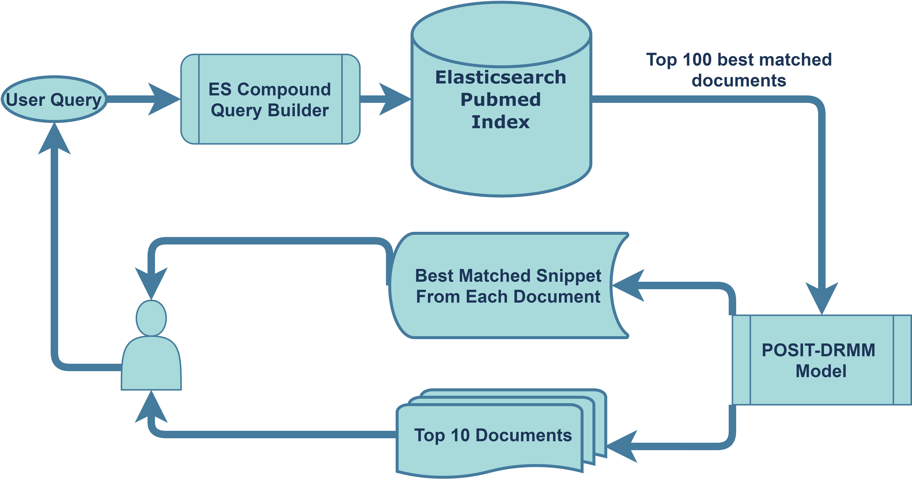

# Tibot Pubmed Document and Snippet Retriever ##
The Original Project was authored by AUEB as submission to the BIOASQ-7 compition. It was repurposed to be used for our application. 

#### Changes from the original work
- Initial Application Configuration
	- The projrct initially used **galago** to rank and retrieve the related Pubmed papers based on **BM25** score and **mongodb** to store the data.
The app had to call galago to get the top ranked 25 documents then the app would pull the top document data from mongodb. Then the documents were ranked by a Word2vec based Pooled Similarity Deep Relevance Matching Model (POSIT-DRMM) model.
We fine-tuned the POSIT-DRMM model with our hand crafted dataset on eczema questions. (Note: There were couple of different models but we chose the W2V model due to it's speed advantage.)
- Current Application Configuration
	- Later we have dumped galago and mongodb in favour of **ElasticSearch** to rank and retrieve documents. ElasticSearch also uses BM25 algorithm to rank the Pubmed papers but it uses a slight different version called **Okapi BM25**. \
\

#### How does it work???
- **From user's perspective:**
  1. User inputs a question, the system returns top 10 medical paper and relevant snippets from the paper's title and abstruct.
- **What's happening underneath?**
  1. The app takes in the user's question and creates a compound query for ElasticSearch. 
  ```
  {
        "size": n,
        "query": {
            "bool": {
                "should": [
                    {"match": {"AbstractText": question}},
                    {"match": {"ArticleTitle": question}},
                    {
                        "range": {
                            "DateCreated": {
                                "gte": "1800",
                                "lte": str(max_year),
                                "format": "dd/MM/yyyy||yyyy"
                            }
                        }
                    },
                    {
                        "range": {
                            "ArticleDate": {
                                "gte": "1800",
                                "lte": str(max_year),
                                "format": "dd/MM/yyyy||yyyy"
                            }
                        }
                    }
                ],
                "minimum_should_match": 1,
            }
        }
    }
	```
  2. The query request is made to the ElasticSearch server with Pubmed index running in the background using ElasticSearch python api and the response has 100 best match pubmed documents based on BM25 score. 
  3. The fetched documents are then restructured into document data and document metadata to be fed into the POSIT-DRMM model reranking and getting most relevant snippets.
  4. The POSIT-DRMM model them **reranks the fetched documents and gets best relevant snippet from each document.**
- **Dataset Description**
	1. **Pubmed Index:** The elasticsearch pubmed index initially had 31 Million documents. The documents with missing AbstractText and ArticleTitle were removed. Finally we have approximately 20 Million of documents. (Use the [Pubmed_Elasticsearch_Index_builder](https://github.com/traindi/tibot-ml-experiments/tree/working/Pubmed_Elasticsearch_Index_builder) scripts and instructions to build/ restore the pubmed index)
	2. **Original W2V Dataset:**  The W2V model was initially trained on the years 1–6 of the bioasq data cosisting of 2,647 questions.
	3. **FineTune dataset:** We created our own dataset by initially querying to the original app and then reranking the responses by hand. An additional 422 eczema related query and corresponding documents were added to the original dataset.
	4. This final dataset was used to train the model from scratch for our app.
- **Technologies Used:**
	1. For Database, ElasticSearch is used.
	2. The POSIT-DRMM model is trained using pytorch.
	3. The Model is served using Flask.
	4. The Application and Database is depolyed using DOCKER-COMPOSE and the base docker image is [tiangolo/uwsgi-nginx-flask/python3.6-2020-05-07](https://github.com/tiangolo/uwsgi-nginx-flask-docker) .
  
- **Skin Conditions Covered:**
		- [x] Eczema :thumbsup:
        - [ ] Psoriasis (Will be implemented soon) :point_left:
		- [ ] Acne (Will be implemented soon) :point_left:
		
###### Authored by:
Md.Adnan Taufique:neckbeard: \
Machine Learning Engineer\
Polyfins Technology Inc.